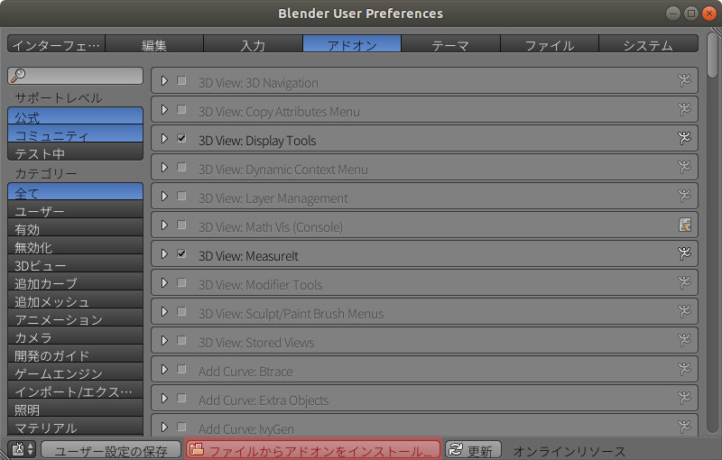
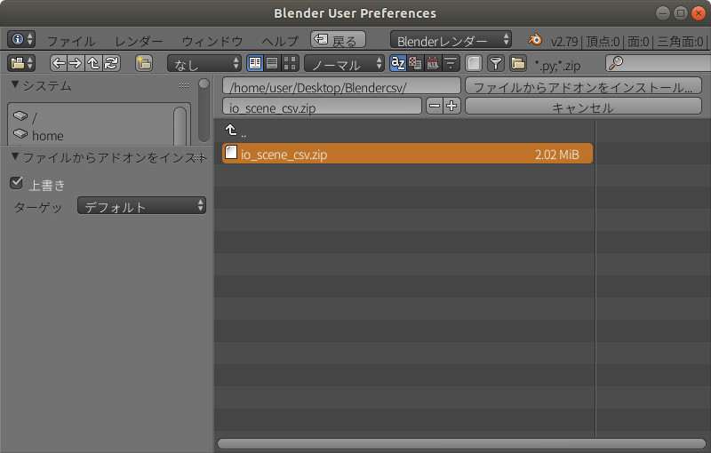
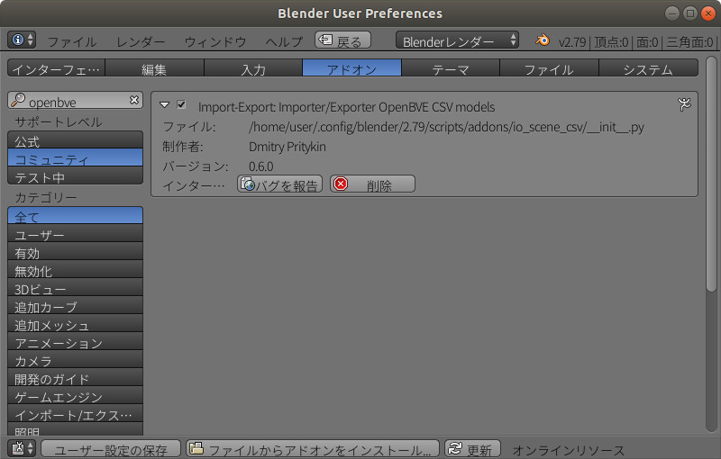
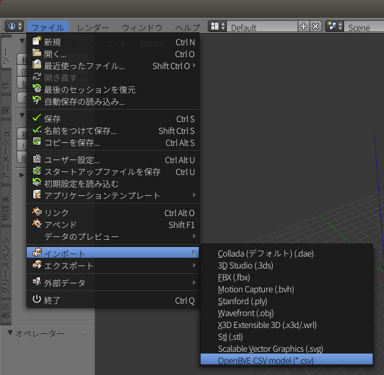
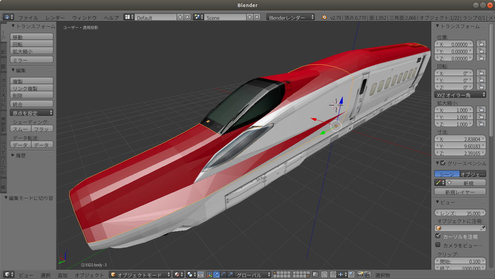
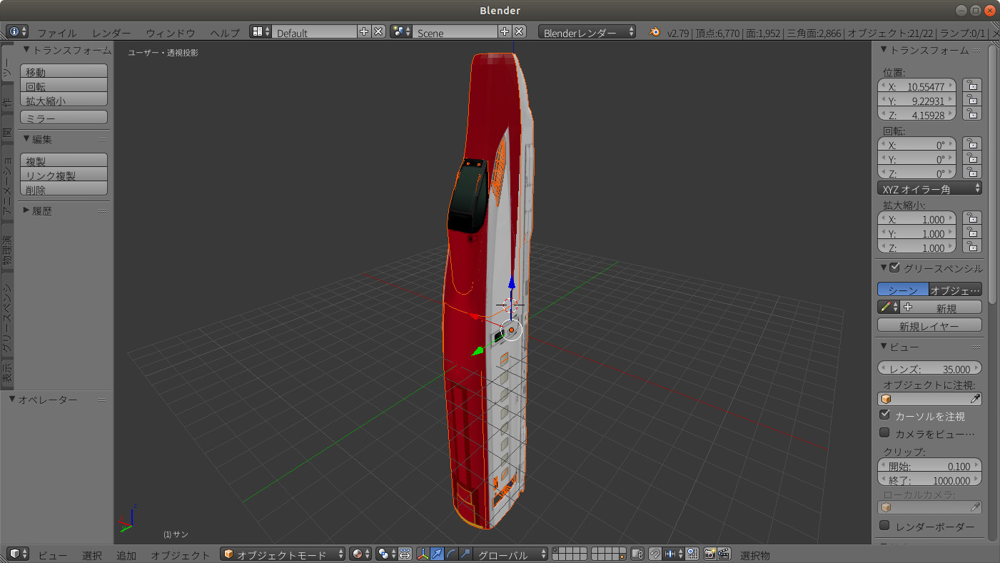
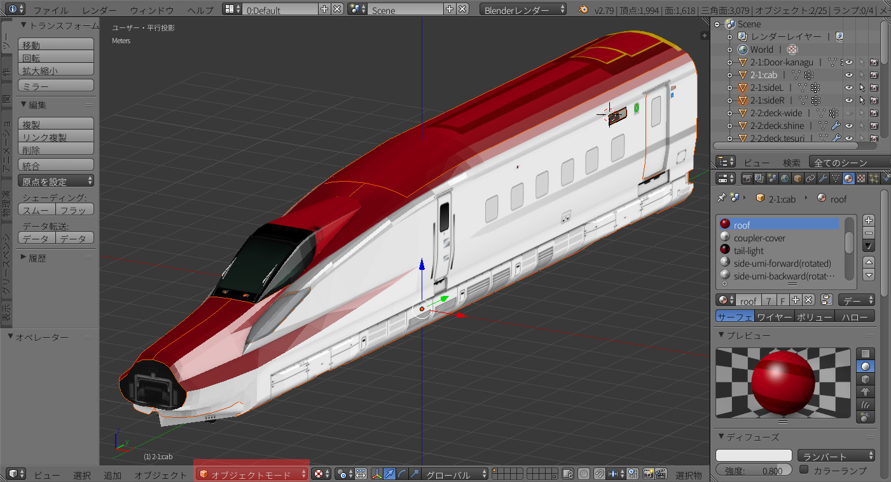
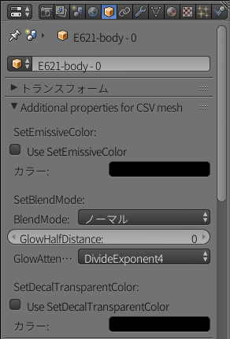
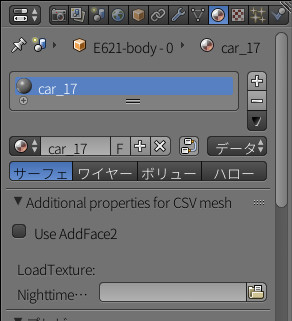

[English](README.md)

# Blender plugin for Import|Export OpenBVE \*.csv objects

本プラグインはBlender2.79に対応しております。**現在のバージョンは2.80への対応しておりません。**

## 1. インストールガイド

1. 最新のリリースを [Releases section](https://github.com/maisvendoo/blenderCSV/releases) からダウンロードして下さい。
2. Blenderを開き、メインメニューのファイル -> ユーザー設定 -> アドオンを選択します。
3. "ファイルからアドオンをインストール"を選択します。

4. プラグインのzipファイルを選択します。

5. 有効化するために、チェックボックスをONにします。

6. "ユーザー設定の保存"を押し、変更を有効にした上でBlenderを再起動します。
## 2. プラグインを使う
### 2.1 \*.csvをBlenderにインポートする

1. ファイル -> インポート -> OpenBVE CSV model (\*.csv)と選択します。
   

2. インポートオプションを選択します。

   

   - *Set logging Level*: ログへ出力する情報の閾値を選択します。デフォルトでは"INFO"です。
   - *Transform coordinates*: OpenBVEの左手座標系からBlenderの右手座標系へ変換するか選択します。デフォルトでは有効です。
   - *Split AddFace2:* AddFace2で生成される面を別々の面に分割して取り込みます。その際、AddFace2フラグは解除されます。

3. ファイルシステムからモデルを選択後、"OpenBVE model (\*.csv)"ボタンを押し、現在のワークスペースにインポートします。
   

   インポートオプションの*Transform coordinates*を無効にすると下図のようになります。
   

### 2.2 Blenderから\*.csvへエクスポートする

1. Blenderでエクスポートしたいモデルを**オブジェクトモードにしてから**選択します。
   
2. ファイル -> エクスポート -> OpenBVE CSV model (\*.csv)と選択します。
3. エクスポートオプションを選択します

   

   - *Set logging Level*: ログへ出力する情報の閾値を選択します。デフォルトでは"INFO"です。
   - *Transform coordinates*: Blenderの右手座標系からOpenBVEの左手座標系へ変換するか選択します。デフォルトでは有効です。
   - *Set global scale*: 大きさの倍率を変更します。デフォルトでは1.0です。
   - *Output Normals*: 法線を出力するか選択します。デフォルトでは有効です。
   - *Copy textures in separated folder*: 全てのテクスチャファイルを新たなフォルダを作成し、コピーします。csvファイルと同じフォルダ階層に作られ、フォルダ名はモデル名-texturesになります。デフォルトでは有効です。

4. ファイルシステムからモデルの出力先を選択後、"OpenBVE model (\*.csv)"ボタンを押し、エクスポートします。

5. 結果をOpenBVEのObjectViewerで確認します。
    
## 3. OpenBVE特有の属性
Additional properties for CSV meshにおいて、OpenBVE特有の属性を付与することが出来ます。

**注意: これらの属性はBlenderの3Dビューの表示に反映されません。**

### 3.1 オブジェクトプロパティ

- *SetEmissiveColor*: SetEmissiveColorの有効/無効と、その色を設定できます。
- *SetBlendMode*: SetBlendModeのBlendMode(Normal/Additive)、GlowHalfDistanceの距離、GlowAttenuationMode(DivideExponent2もしくは4)を設定できます。
- *SetDecalTransparentColor*: BMPなどSetDecalTransparentColorが必要なテクスチャを用いる場合、ここで有効/無効と色を設定できます。

### 3.2 マテリアルプロパティ

- *Use AddFace2*: マテリアルをエクスポート時にAddFace2で両面化させる際に有効/無効が指定できます。
- *LoadTexture*: LoadTextureのNighttimeTextureを指定できます。

## 4. デバッグ

このプラグインはログをホームディレクトリ直下の`io_scene_csv_log.txt`へ出力します。

具体的には下記の通りです。

- Windows
  `C:\Users\<UserName>\io_scene_csv_log.txt`
- Linux/macOS
  `~/io_scene_csv_log.txt`

## 5. ライセンス

このプラグインは*GPL-2.0*の下でライセンスされています。
### サードパーティのライブラリ
- このプラグインは**Chardet**を文字エンコーディングを決定するために使用しています。これは`io_scene_csv/chardet/LICENSE`に従い、*LGPL-2.1*の下でライセンスされています。
