[Japanese](README-ja.md)

# Blender plugin for Import|Export OpenBVE \*.csv objects

This plugin only works on Blender 2.79. **Please note that it will NOT work on 2.80.**

## 1. Installation guide

1. Please download from [Releases section](https://github.com/maisvendoo/blenderCSV/releases) the newest release.
2. Open Blender, and choose File -> User Preferences... -> Add-ons from main menu.
3. Choose "Install Add-on from File...".
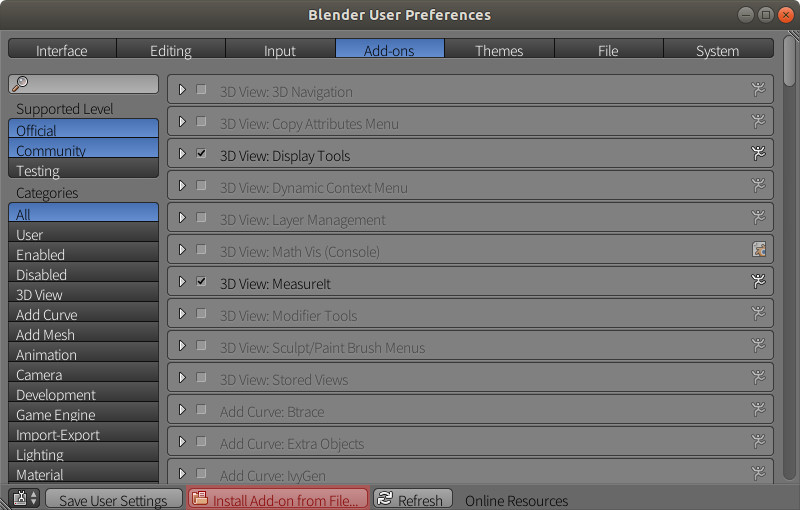
4. Choose plugins zip file.
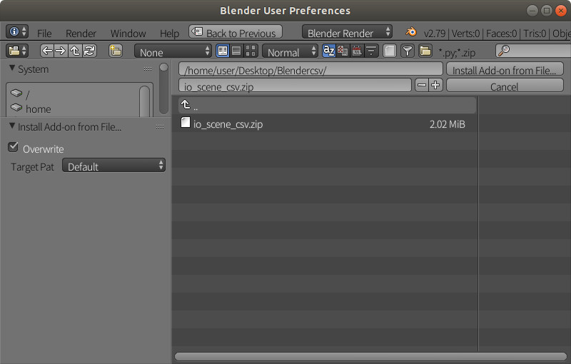
5. To enable the plugin, turn on the checkbox.
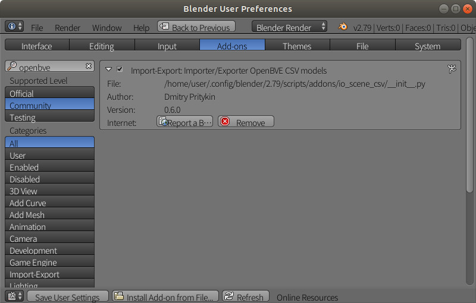
6. To enabled the setting, press "Save User Settings",  and restart Blender.
## 2. Using plugin
### 2.1 Import \*.csv model file to Blender

1. Choose File -> Import -> OpenBVE CSV model (\*.csv) from main menu.
   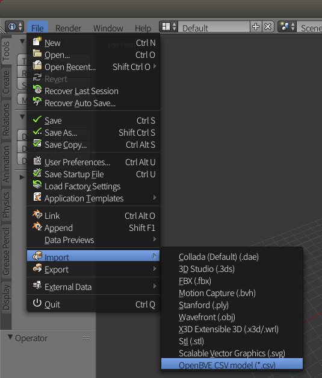

2. Select import options.

   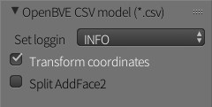

   - *Set logging Level*:  select threshold level for the log file. The default setting is "INFO".
   - *Transform coordinates*: If you want to change OpenBVE 's Left-handed coordinate system to Blender's Right-handed coordinate system, check this option. The default is enable.
   - *Split AddFace2:* If this option is enabled, AddFace2's double-sided is split to an each face. After split, each faces Material's AddFace2 option is turn off automatically.

3. After choose the \*.csv model from filesystem, press the "OpenBVE model (\*.csv)" button, then import the model.
   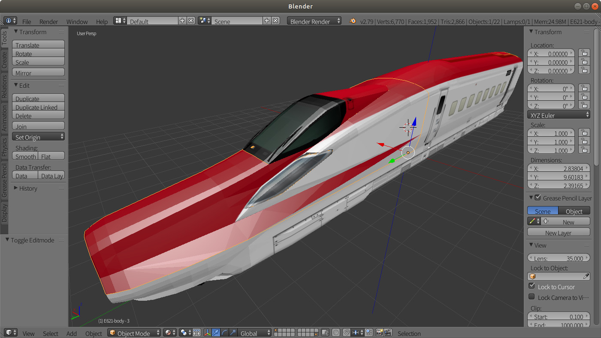

   If you are turn off the *Transform coordinates* option, the imported model is as shown below.
   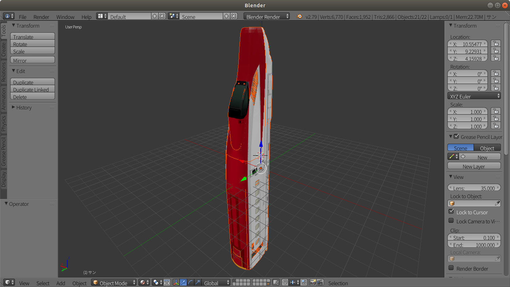

### 2.2 Exporting from Blender to \*.csv model file

1. Before the choose export object, **you must change mode to "Object Mode"**. After changed, you can choose export object(s).
   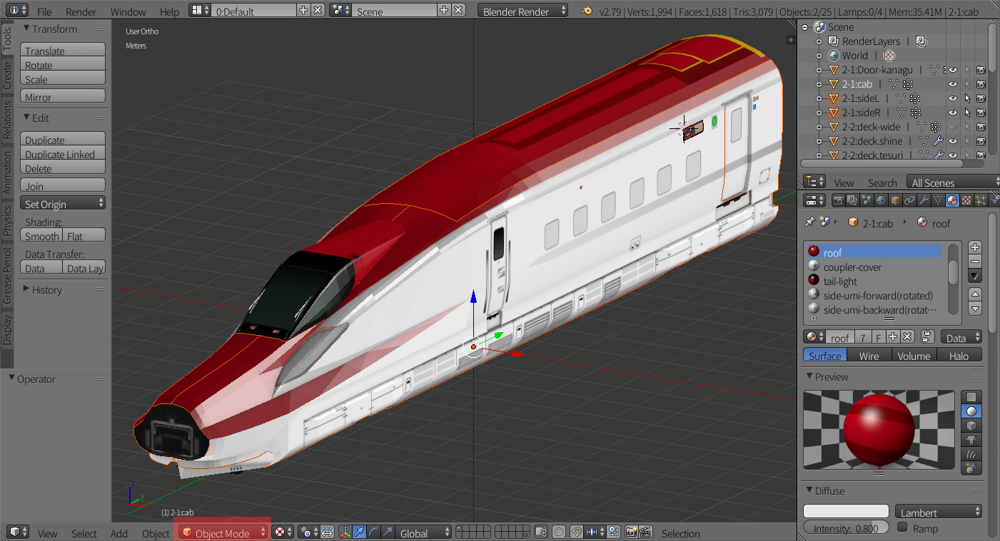
2. Choose File -> Export -> OpenBVE CSV model (\*.csv) from main menu.
3. Choose export options.

   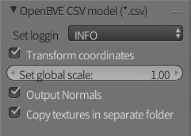

   - *Set logging Level*: select threshold level for the log file. The default setting is "INFO".
   - *Transform coordinates*: If you want to change Blender's Right-handed coordinate system to OpenBVE 's Left-handed coordinate system, check this option. The default is enable.
   - *Set global scale*: Set the scale factor. The default value is 1.0.
   - *Output Normals*: If you want to export add normals, check this option. The default is enable.
   - *Copy textures in separated folder*: All texture files are copy to the new folder. the new folder is the same folder level, and folder name is 'model name'-textures. This option is enable by default.
4. 
    After choose the \*.csv model from filesystem, press the "OpenBVE model (\*.csv)" button, then export the model.
    
5. Check the export result by the ObjectViewer of OpenBVE.
    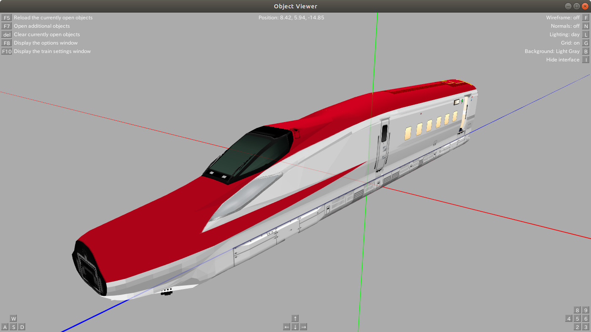
## 3. The specific attributes for OpenBVE
At the Additional properties for CSV mesh, you can be assigns the specific attributes for OpenBVE.

**NOTE: These specific attributes are not reflected to the Blender's 3D view.**

### 3.1 Object Property
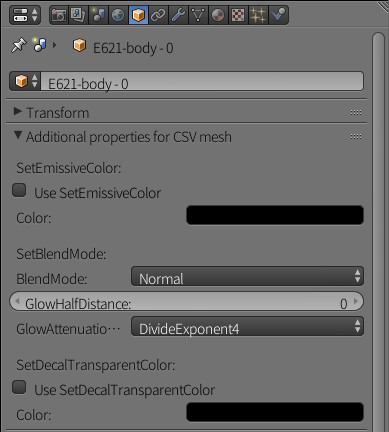

- *SetEmissiveColor*: Enable/Disable ,and set color of SetEmissiveColor.
- *SetBlendMode*: You can set the SetBlendMode's BlendMode(Normal/Additive), GlowHalfDistance's distance, and GlowAttenuationMode(DivideExponent2 or 4).
- *SetDecalTransparentColor*: For example of the BMP, If you want to use the case of require SetDecalTransparentColor, you can set Enable/Disable ,and set color of SetDecalTransparentColor.

### 3.2 Material Property

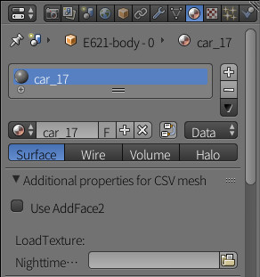

- *Use AddFace2*:  If this option is enabled, when you are the exporting, you can enable the material to the double-sided by Addface2.
- *LoadTexture*: If this file is selected, you can set the NighttimeTexture for LoadTexture.

## 4. Debugging

This plugin is output a log file of `io_scene_csv_log.txt` at the under the home directory.

Specifically, the folder placing is showing below.

- Windows
  `C:\Users\<UserName>\io_scene_csv_log.txt`
- Linux/macOS
  `~/io_scene_csv_log.txt`

## 5. License

This plugin is licensed under *GPL-2.0*.

### Third party license
- This plugin uses **Chardet** to determine the character encoding. This is licensed under the *LGPL-2.1* as per `io_scene_csv/chardet/LICENSE`.
